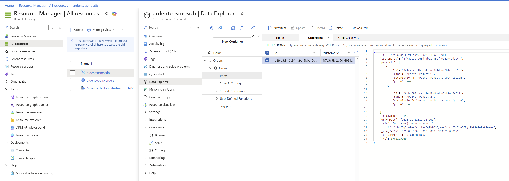

## Order API Overview

Implement a basic CRUD API that integrates with Azure CosmosDB.

Example order (Azure Cosmos DB document):

{
  "id": "b2f8a3d4-6c9f-4a9a-9b0e-0c8d7b1a9e11",
  "customerId": "4f7a3c9b-2e5d-4b91-a8ef-9b6a7c2d3e44",
   "products": [
       {
           "id": "9d1c2f7a-1b3e-4f8a-9a4d-6c2b1e0f3a99",
           "name": "Ardent Product 1",
           "description": "Ardent Product 1 Description",
           "price": 100
       },
       {
           "id": "7a6b5c4d-3e2f-1a9b-8c7d-6e5f4a3b2c11",
           "name": "Ardent Product 2",
           "description": "Ardent Product 2 Description",
           "price": 50
       }
   ],
  "totalAmount": 150.00,
  "orderDate": "2026-01-11T10:30:00Z"
}

